# 📁 Project Details

> **🕒 최신순 정렬**
>
> 프로젝트는 실제 구현 정도, 배포 여부, 협업 방식 등을 기준으로 구성되어 있으며, 중요 프로젝트에는 대표 이미지 및 링크를 함께 제공합니다.

## 🔍 전체 요약
**#Java #SpringBoot #Vue #Fullstack #ProjectManagement #ProblemSolving #TeamCommunication**

---

## 📘 Diary (감정 다이어리 웹앱)
- **기간**: 2024.12 ~ 2025.02
- **기술 스택**: Vue, Spring Boot, MySQL, JWT, AWS EC2, S3, Nginx
- **주요 기능**:
  - 감정지수 + 해시태그 기반 감정 일기 저장
  - 카카오 메시지 API 연동 (사용자 다이어리 알림)
  - 배포 자동화(Crontab), 정적/동적 파일 분리 배포
- **성과**:
  - 실무 환경과 유사한 구조로 구성 (프로덕션 배포 완료)
  - 프론트-백엔드-인프라 전반을 직접 설계 및 운영
- **GitHub**: [Diary Repository](https://github.com/feed-mina/Diary)
- **배포 URL**: [https://justsaying.co.kr](https://justsaying.co.kr)

### 🖼 대표 화면

| 메인페이지 | 튜토리얼 | 감정 일기 작성 | 일기 리스트 | 상세 보기 |
|------------|----------------|--------------|------------|
| 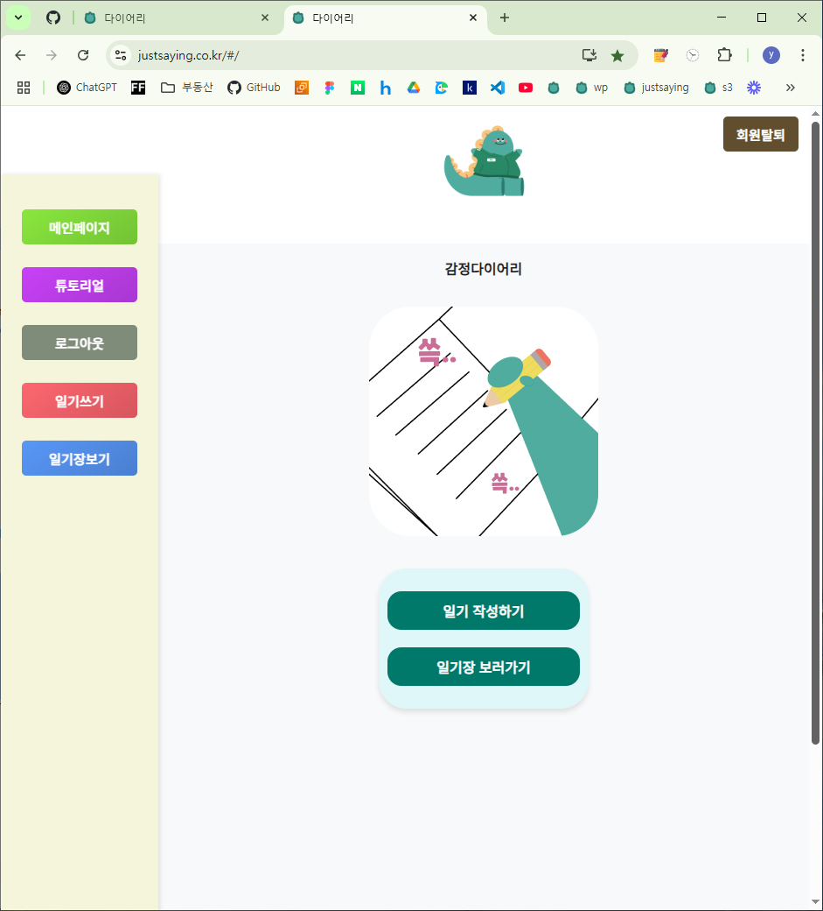 | 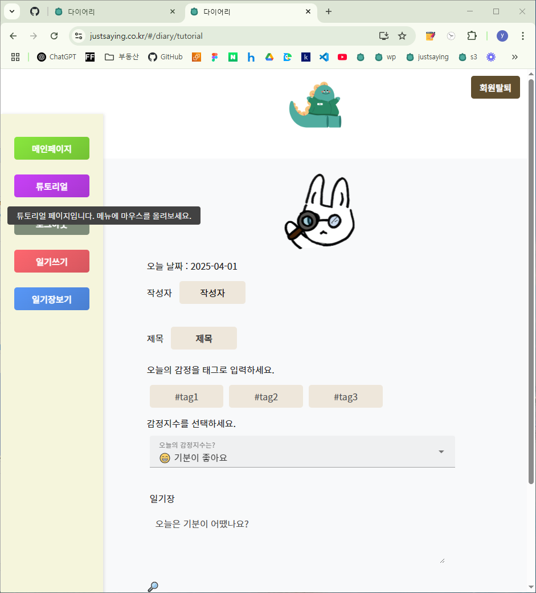 | 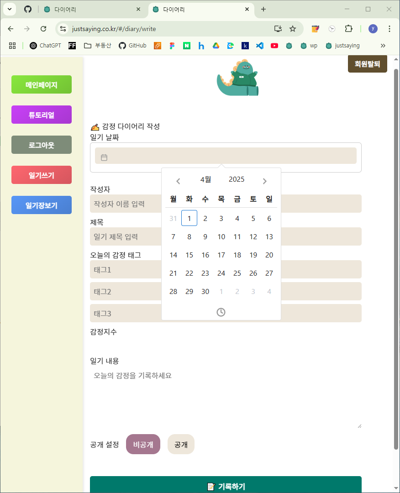 | 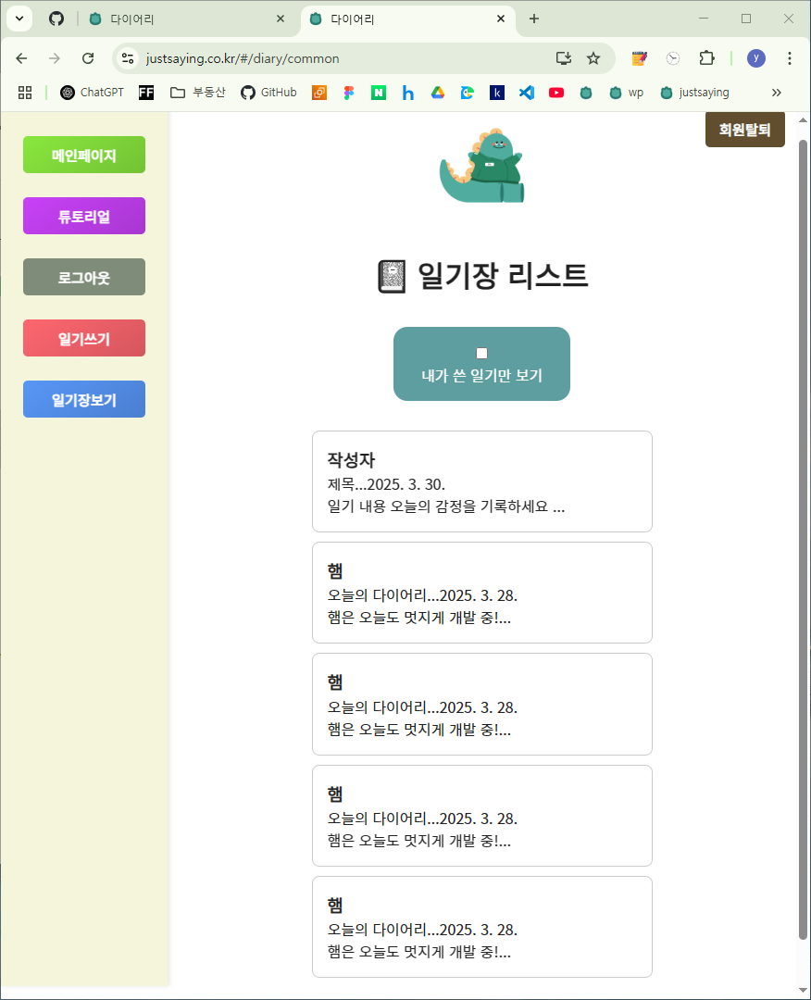 | 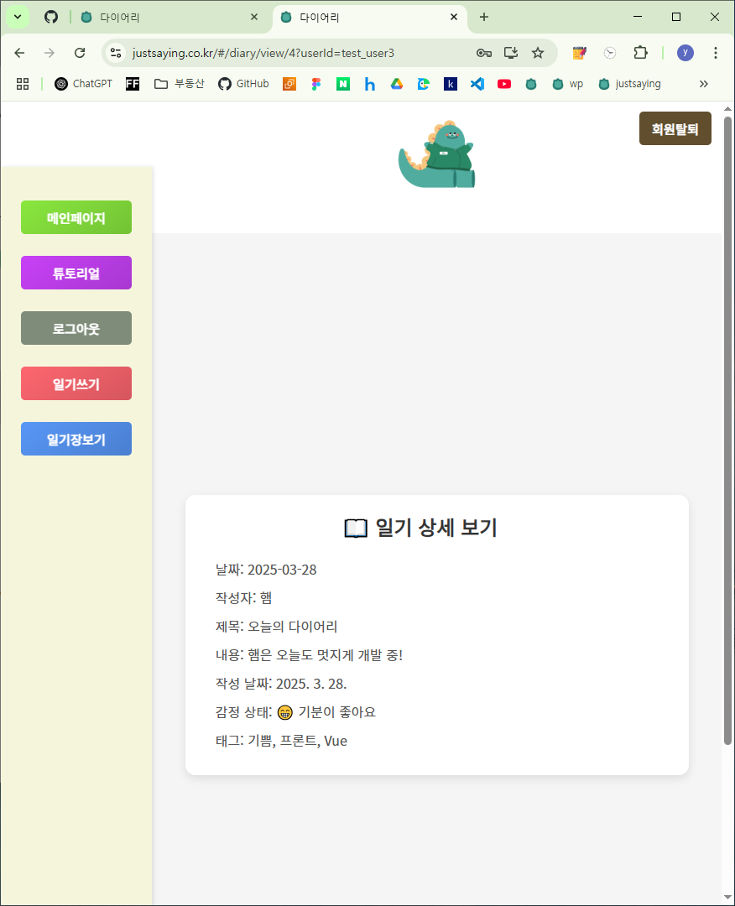 |

  
> “기록된 감정이 쌓이면, 나는 조금 더 나를 이해할 수 있을까?”  
> 감정과 일상을 기록하는 웹앱을 만들고 싶어서 시작했어요.  
> Vue3와 Spring Boot로 프론트와 백을 직접 구성하고 JWT 로그인부터 메시지 전송, 배포 자동화까지  
> 실무에서 겪을 수 있는 대부분의 기능들을 경험하며 전체 구조 설계의 자신감을 얻은 프로젝트예요.

---

## ⏱ StopWatch (뽀모도로 타이머 데스크탑 앱)
- **기간**: 2024.09 ~ 2024.10
- **기술 스택**: Vue, Electron
- **주요 기능**:
  - 25분 집중 / 5분 휴식 루프 타이머
  - 다크/라이트 모드 전환, 간결하고 예쁜 UI
- **성과**:
  - Electron 기반 데스크탑 앱 개발 경험
  - 뷰 프레임워크로 상태 관리 및 모듈화 설계
    
- **GitHub**: [StopWatch](https://github.com/feed-mina/StopWatch)
  

### 🖼 대표 화면

| 라이트 모드 | 다크 모드 | 카카오톡 메시지 |
|-------------|-----------|------------------|
| 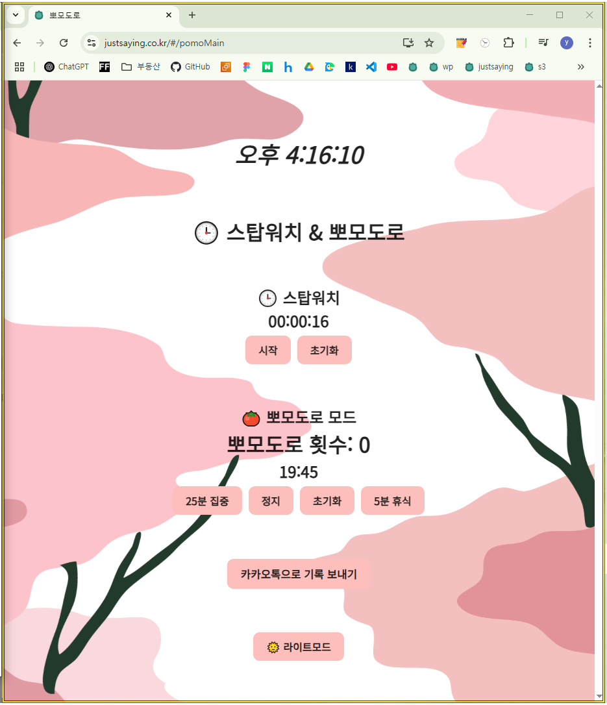 | 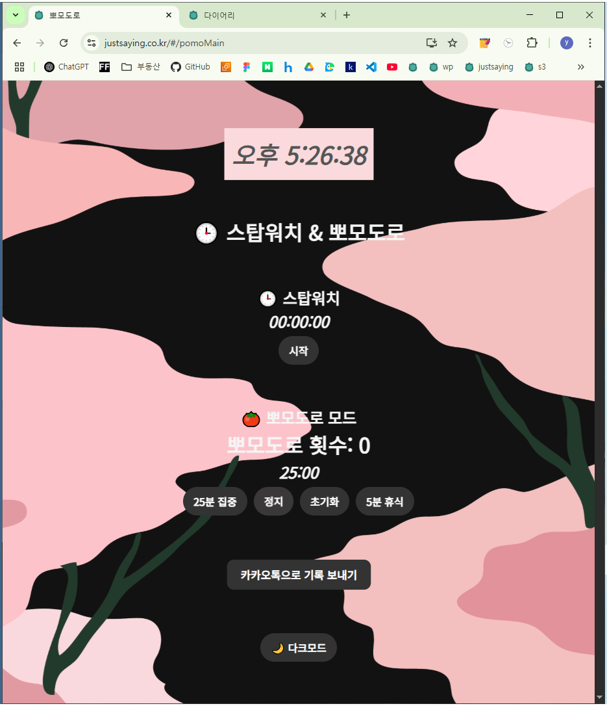 | 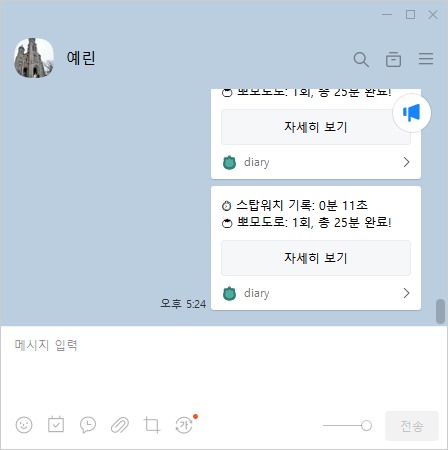 |

---

> “작은 집중이 모이면 결국 큰 성취가 된다.”  
> 집중이 힘들었던 시기에 뽀모도로 타이머로 루틴을 만들고 싶어서 시작한 프로젝트입니다.  
> Vue로 예쁜 타이머 UI를 만들고, Electron으로 데스크탑 앱으로 포장하며  
> 실제로 공부와 업무에 바로 쓸 수 있는 도구로 발전시켰습니다.  
> 또한 카카오 API를 연동하여, 집중한 시간을 메시지로 공유하는 기능도 구현했습니다.

---

## 📙 TABA1-CCCR (AI 이미지넷 분류 예측)
- **기간**: 2022.08 ~ 2022.12
- **기술 스택**: Python, Flask, AWS, Azure
- **주요 기능**:
  - 이미지넷 기반 분류 예측 모델 학습 및 시각화
  - PPT 기반 프로젝트 발표 자료 구성
- **성과**:
  - **TABA 공모전 최우수상 수상** 🏆
  - 이미지 분류 결과를 시각화하여 직관적으로 설명
- **자료**: `프로젝트 발표 PPT` 참고 ([TABA_Presentation.pdf](https://github.com/feed-mina/Resume/blob/main/TABA_Presentation.pdf))
- **GitHub**: [TABA1 Repository](https://github.com/feed-mina/TABA1-_CCCR_-)

> "AI를 통해 이미지 속 세상을 이해할 수 있을까?"

> 대학과 기관이 함께한 공모전에서, AI 기반 이미지 분류 프로젝트를 맡았어요.
> 단순히 정확도를 높이는 것에 그치지 않고,
> 모델이 어떻게 예측했는지를 시각화하는 데 집중했어요.

> Python과 Flask, 그리고 Azure 환경에서 실험을 거듭하며
> 결과를 눈으로 볼 수 있는 방식으로 설명하는 법을 배웠고,
> 이 과정에서 최우수상이라는 결과도 얻게 되었어요.

> 이 경험은 이후 웹과 백엔드 개발을 공부할 때도
> "복잡한 기술을 어떻게 직관적으로 전달할 수 있을까?"라는 질문의 기반이 되었어요.
---

## 💄 MIMO (가상 메이크업 웹앱)
### 💄 MIMO (가상 메이크업 시뮬레이션 웹앱)

**기술 스택**: React, Spring Boot, Node.js, TensorFlow, OpenCV, MySQL, Firebase  
**역할**: 프론트엔드 개발 100% + UI/UX 설계

화장품을 구매하기 전 직접 얼굴에 적용해볼 수 있는 웹 기반 메이크업 시뮬레이션 서비스입니다.  
웹캠으로 얼굴을 촬영하고 AI(U-Net 기반 세그멘테이션 모델)를 활용해 립스틱 색상을 실시간으로 시뮬레이션합니다.  
소셜 로그인(OAuth), 장바구니, 리뷰 작성 등 전자상거래 기능과 함께,  
React + Spring Boot + AI 모델 서버를 통합적으로 연동하며 풀스택 개발 실무를 경험했습니다.  
구글 클라우드에 배포하고 Firebase와 연동하며 팀 프로젝트 협업을 마무리했습니다.

- **GitHub**: [MIMO Repository](https://github.com/feed-mina/MIMO)
### 🖼 대표 화면

### 🖼 대표 화면 (1/2)

| 메인페이지 | 상품 상세 | 리뷰 작성 |
|------------|-----------|------------|
| 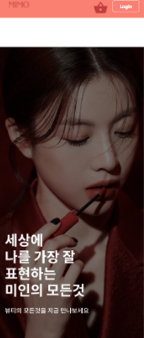 |  | 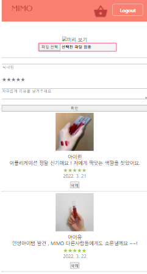 |

### 🖼 대표 화면 (2/2)

| 튜토리얼 | 카메라 시뮬레이션 |
|----------|------------------|
| 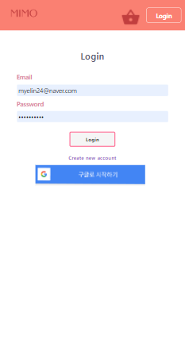 | 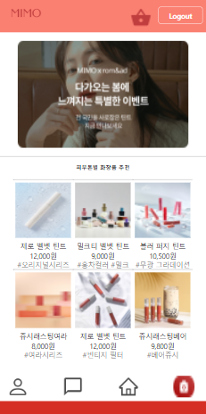 |

---

## 🧩 구로 청년 이룸: 일당백 웹사이트
- **기간**: 2022.04.02 ~ 2022.05.21
- **기술 스택**: React.js
- **구성원**: 프론트 1명 / 백엔드 1명 / 디자이너 1명 / 마케터 2명
- **주요 기능**:
  - 밸런스 게임 / 심리테스트 / 댓글 기능 / GA 태깅
- **성과**:
  - 반응형 웹 미처 고려하지 못한 문제 해결 경험
  - 기획-디자인-개발 전체를 리딩하며 팀 1등 수상
- **GitHub**: [일당백 Repository](https://github.com/feedmina/hardcarry2_team3)
- **📸 주요 화면 (예정)**:
  

> 구로 청년 이룸 일당백 웹사이트 프로젝트
> 청년 커뮤니티 활성화를 목표로 진행한 프로젝트로, React.js를 활용해 이벤트 기반 웹앱을 개발했습니다.
> 팀장으로서 개발과정을 조율하며, 초기 기획 단계부터 사용성 높은 기능을 기획하고 구현했습니다.
> 처음에 반응형 웹 구현을 고려하지 못한 점을 팀원들과 솔직하게 공유하고 일정을 재조정하며 문제를 해결했습니다.
> 이를 통해 내비게이션, 밸런스 게임, 댓글 및 일기장, 심리테스트 등 다양한 기능을 완성했습니다.
> 사용자 참여 유도를 위한 마케팅과 데이터 추적까지 성공적으로 마무리했습니다.
> 팀의 협력을 바탕으로 전체 1등을 달성하며, 협업의 가치와 리더십의 중요성을 다시 한번 깨닫는 계기가 되었습니다.
---

> 위 프로젝트 외에도 기타 개발 기록은 [https://github.com/feed-mina](https://github.com/feed-mina)에서 확인하실 수 있습니다.

