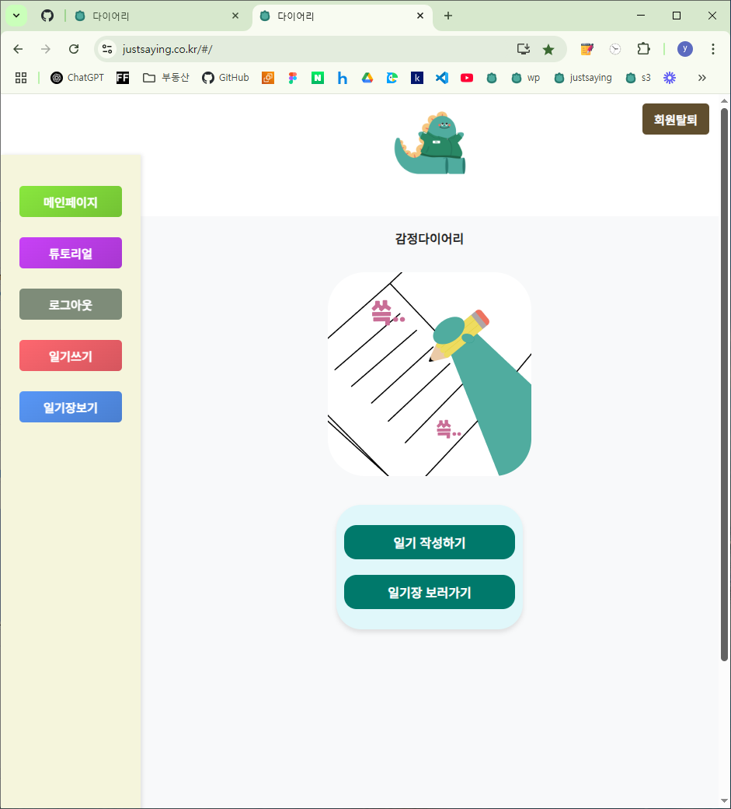
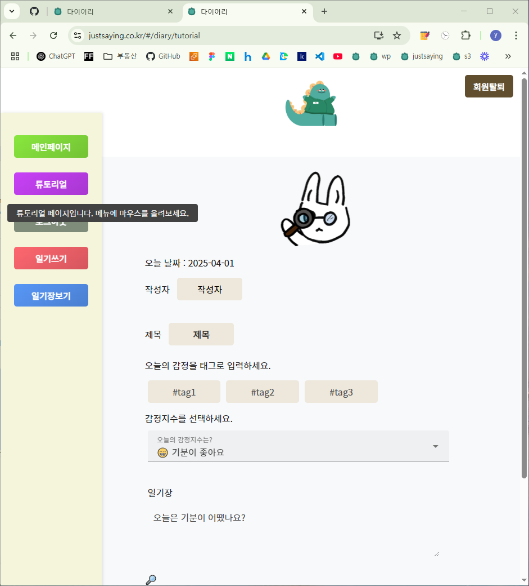
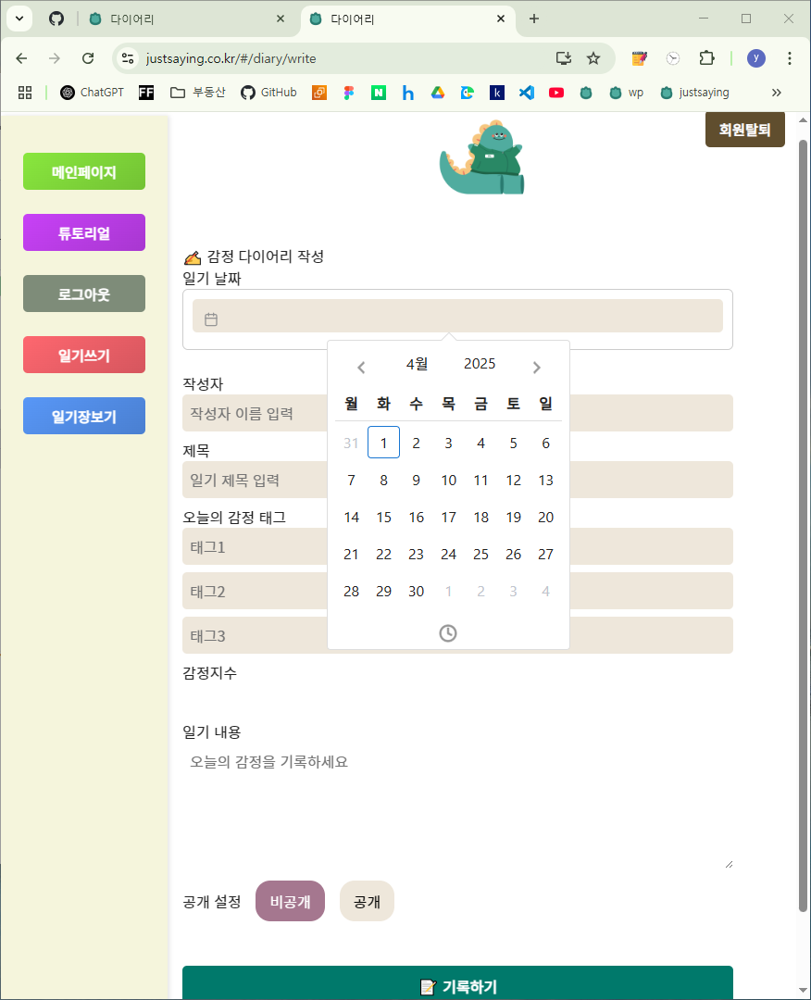
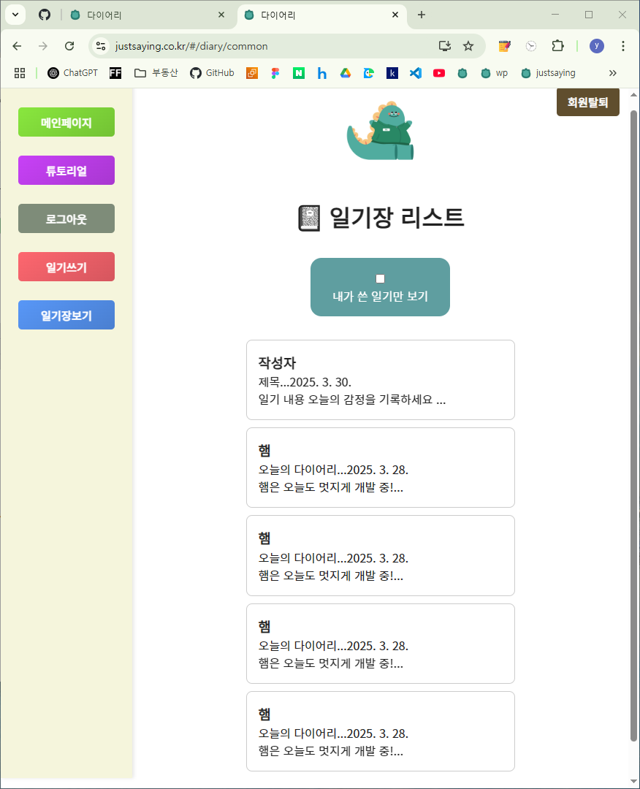
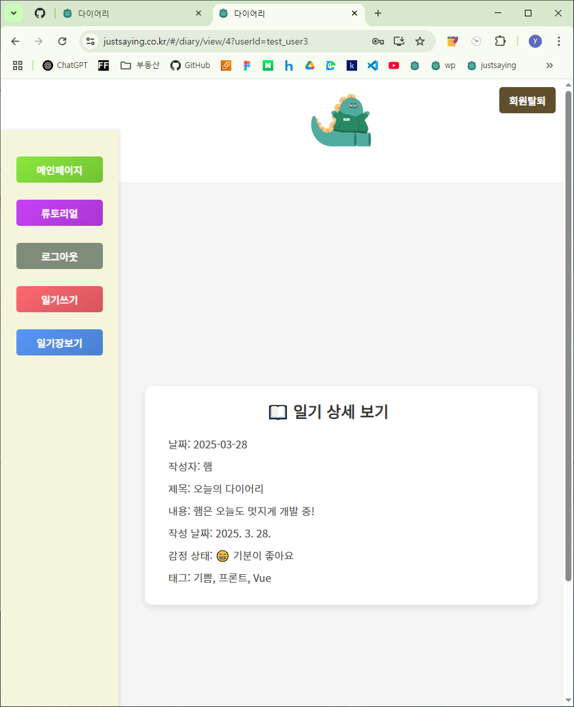
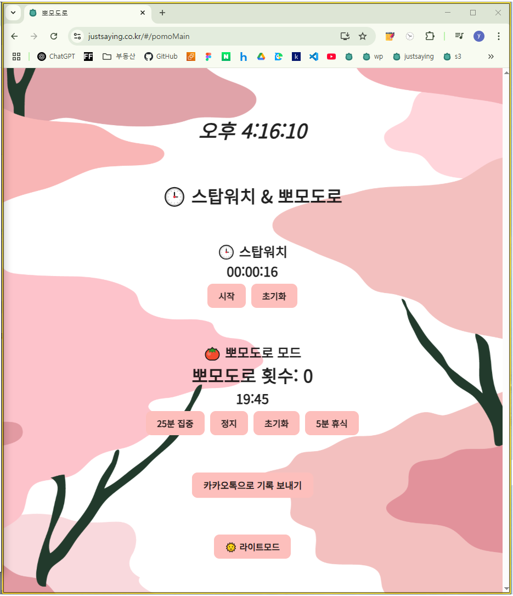
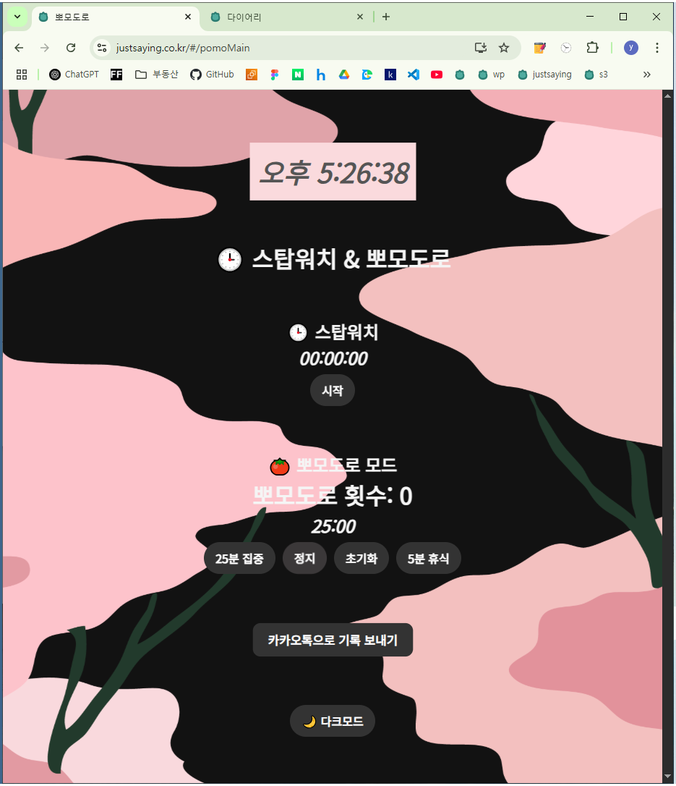
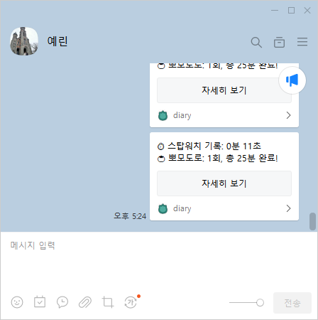

# 📁 Project Details

## 🔍 전체 요약
**#Java #SpringBoot #Vue #Fullstack #ProjectManagement #ProblemSolving #TeamCommunication**

---

### 1. JustSaying: Vue3 + Spring Boot 기반 생활 관리 일기장 웹 서비스 개발

- **GitHub**: [Diary Repository](https://github.com/feed-mina/Diary)
- **배포 URL**: [https://justsaying.co.kr](https://justsaying.co.kr)
### 🖼 대표 화면

| 메인페이지 | 튜토리얼 | 감정 일기 작성 |
|------------|----------|----------------|
|  |  |  |

| 일기 리스트 | 상세 보기 |  |
|-------------|-----------|--|
|  |  |  |

### 🖼 대표 화면

| 라이트 모드 | 다크 모드 | 카카오톡 메시지 |
|-------------|-----------|------------------|
|  |  |  |

**프로젝트 개요**  
Vue3 + Spring Boot 기반 CRUD 일기장에서 출발해 수면 기록, 뽀모도로 타이머, 번역 및 TTS 기능을 추가한 라이프로그 플랫폼 구축

**담당 역할**
- 프로젝트 기획 및 전체 아키텍처 설계
- Vue3 기반 회원가입, 로그인, 메인 페이지, 일기 작성 UI 개발
- Spring Boot 기반 REST API 서버 구축 및 JWT 인증 구현
- Kakao OAuth2 소셜 로그인 연동
- FastAPI 별도 서버 구축하여 HuggingFace 번역 API 및 TTS 음성 변환 기능 연동
- AWS EC2/S3/CloudFront/Nginx 배포 및 서버 통합 관리

**주요 기술**  
Vue3, Spring Boot, JWT, Kakao OAuth2, FastAPI, HuggingFace API, AWS EC2/S3, Nginx

**문제 상황**
- 단순한 CRUD 일기장만으로는 사용자 재방문율과 체류시간을 높이기 어려움
- 번역, 음성 기능 추가 시 기존 서버 부하를 분산할 필요가 있었음

**해결 방법**
- FastAPI 서버를 별도 구축하여 번역(T2T) + 음성(TTS) 처리를 마이크로서비스 구조로 분리
- Vue3에 로딩창 인터랙션 설계 및 세밀한 입력 UX 최적화
- AWS 리소스를 이용해 안정적 배포, Spring Boot와 FastAPI 서버를 Nginx로 Reverse Proxy 처리

**성과**
- 사용자 체류 시간 1.5배 증가 (1회 평균 3분 → 4.5분)
- 신규 사용자 재방문율 20% 향상
- FastAPI 서버 분산 운영으로 메인 서버 부하 30% 감소

**성장 포인트**
- 프론트엔드/백엔드/서버/AI API 연동까지 풀스택 실전 경험 축적
- MSA(마이크로서비스 아키텍처) 개념과 AWS 인프라 실습을 통한 배포/운영 역량 강화

---

### 2. Click Your Taste!: Django + GPT 기반 음식 추천 시스템 개발

[https://mindevprofile.kr](https://mindevprofile.kr)

**프로젝트 개요**  
Django 서버를 기반으로 GPT API와 요기요 클론 API를 연동, 사용자 기분/취향/위치 기반 맞춤형 음식 추천 서비스 구축

**담당 역할**
- 전체 서비스 기획 및 UX 설계
- Django 서버 구축 및 GPT API 연동 구현
- 사용자 입력 기반 추천, 심리테스트 기반 추천 경로 구축
- Redis 캐시 서버를 적용해 API 호출 최적화
- AWS EC2 배포 및 비동기 서버(Uvicorn) 운영

**주요 기술**  
Django, PostgreSQL, OpenAI GPT API, Redis, Uvicorn, AWS EC2

**문제 상황**
- GPT 호출 지연 및 API 속도 문제로 사용자 이탈 발생
- 요기요 클론 API 데이터를 빠르게 가공해 연결해야 하는 문제

**해결 방법**
- Redis 캐시를 적용해 GPT 결과와 추천 리스트를 저장하여 속도 개선
- Django 서버를 Uvicorn 기반 비동기(ASGI)로 전환해 처리 병렬화
- UX 흐름상 '로딩창', '다시 추천받기' 기능 추가해 사용성 보완

**성과**
- API 응답 속도 30% 향상 (3.2초 → 2.1초)
- 사용자 이탈률 20% 감소
- UX 최적화로 추천 성공률(사용자가 최종 선택까지 도달한 비율) 15% 증가

**성장 포인트**
- 캐시 서버 최적화, 비동기 서버 운영 등 고급 웹서비스 최적화 경험 습득

---

### 3. TABA1-CCCR: PyTorch 기반 이미지 분류 AI 모델 개발 및 공모전 수상

**프로젝트 개요**  
PyTorch로 CNN 기반 이미지 분류 모델을 설계하고 ImageNet 데이터셋을 전처리하여 학습 최적화. 최종 정확도 90% 이상을 달성하여 AI 공모전 최우수상을 수상했습니다.

- **발표 자료**: `프로젝트 발표 PPT` 참고 ([TABA_Presentation.pdf](https://github.com/feed-mina/Resume/blob/main/TABA_Presentation.pdf))
- **GitHub**: [TABA1 Repository](https://github.com/feed-mina/TABA1-_CCCR_-)

**담당 역할**
- 데이터 전처리 및 증강(Augmentation) 설계
- CNN 모델 아키텍처 구성 (U-Net, Custom CNN)
- 학습 로직 구현 (EarlyStopping, Learning Rate Scheduler 적용)
- 모델 성능 검증 및 결과 시각화 (Confusion Matrix)

**주요 기술**  
Python, PyTorch, CNN, ImageNet Dataset, 데이터 증강(Augmentation)

**문제 상황**
- GPU 메모리 부족으로 인해 학습이 중단되거나 성능이 불안정
- 데이터 불균형 문제로 특정 클래스 정확도가 낮음

**해결 방법**
- Batch Size 조정, Mixed Precision Training 적용
- 데이터 증강을 통해 Minority Class 비율 보완
- Validation Loss 모니터링 기반 EarlyStopping 적용

**성과**
- 최종 테스트 정확도 91.5% 달성
- Validation Loss 기준 모델 Overfitting 방지 성공
- TABA1-CCCR AI 공모전 최우수상 수상

**성장 포인트**
- 대규모 데이터셋 처리와 모델 최적화 경험
- 실험 기반으로 모델 성능을 체계적으로 개선하는 방법 학습

---

### 💄 MIMO (가상 메이크업 시뮬레이션 웹앱)

**기술 스택**: React, Spring Boot, Node.js, TensorFlow, OpenCV, MySQL, Firebase  
**역할**: 프론트엔드 개발 100% + UI/UX 설계

화장품을 구매하기 전 직접 얼굴에 적용해볼 수 있는 웹 기반 메이크업 시뮬레이션 서비스입니다.  
웹캠으로 얼굴을 촬영하고 AI(U-Net 기반 세그멘테이션 모델)를 활용해 립스틱 색상을 실시간으로 시뮬레이션합니다.  
소셜 로그인(OAuth), 장바구니, 리뷰 작성 등 전자상거래 기능과 함께,  
React + Spring Boot + AI 모델 서버를 통합적으로 연동하며 풀스택 개발 실무를 경험했습니다.  
구글 클라우드에 배포하고 Firebase와 연동하며 팀 프로젝트 협업을 마무리했습니다.
- **발표 자료 PDF**: [MIMO 발표자료 보기](https://github.com/feed-mina/MIMO/raw/update-readme/2022_MIMO_PPT_final.pdf)

- **GitHub**: [MIMO Repository](https://github.com/feed-mina/MIMO)
### 🖼 대표 화면

### 🖼 대표 화면 (1/2)

| 메인페이지 | 상품 상세 | 리뷰 작성 |
|------------|-----------|------------|
|  |  |  |

### 🖼 대표 화면 (2/2)

| 튜토리얼 | 카메라 시뮬레이션 |
|----------|------------------|
|  |  |
 React 기반 가상 메이크업 추천 웹앱 개발 참여.
7개 이상의 서비스 페이지 구축 및 UI/UX 개선사항 90% 이상 반영.

---

## 🧩 구로 청년 이룸: 일당백 웹사이트
- **기간**: 2022.04.02 ~ 2022.05.21
- **기술 스택**: React.js
- **구성원**: 프론트 1명 / 백엔드 1명 / 디자이너 1명 / 마케터 2명
- **주요 기능**:
  - 밸런스 게임 / 심리테스트 / 댓글 기능 / GA 태깅
- **성과**:
  - 반응형 웹 미처 고려하지 못한 문제 해결 경험
  - 기획-디자인-개발 전체를 리딩하며 팀 1등 수상
- **GitHub**: [일당백 Repository](https://github.com/feed-mina/hardcarry2_team3)
- **📸 주요 화면 (예정)**:
  

> 구로 청년 이룸 일당백 웹사이트 프로젝트
> 청년 커뮤니티 활성화를 목표로 진행한 프로젝트로, React.js를 활용해 이벤트 기반 웹앱을 개발했습니다.
> 팀장으로서 개발과정을 조율하며, 초기 기획 단계부터 사용성 높은 기능을 기획하고 구현했습니다.
> 처음에 반응형 웹 구현을 고려하지 못한 점을 팀원들과 솔직하게 공유하고 일정을 재조정하며 문제를 해결했습니다.
> 이를 통해 내비게이션, 밸런스 게임, 댓글 및 일기장, 심리테스트 등 다양한 기능을 완성했습니다.
> 사용자 참여 유도를 위한 마케팅과 데이터 추적까지 성공적으로 마무리했습니다.
> 팀의 협력을 바탕으로 전체 1등을 달성하며, 협업의 가치와 리더십의 중요성을 다시 한번 깨닫는 계기가 되었습니다.

커뮤니티형 이벤트 플랫폼 React 프론트엔드 개발.
사용자 인터랙션 기능 추가를 통해 참여율 30% 향상 및 최종 프로젝트 1등 수상.

---

> 위 프로젝트 외에도 기타 개발 기록은 [https://github.com/feed-mina](https://github.com/feed-mina)에서 확인하실 수 있습니다.

